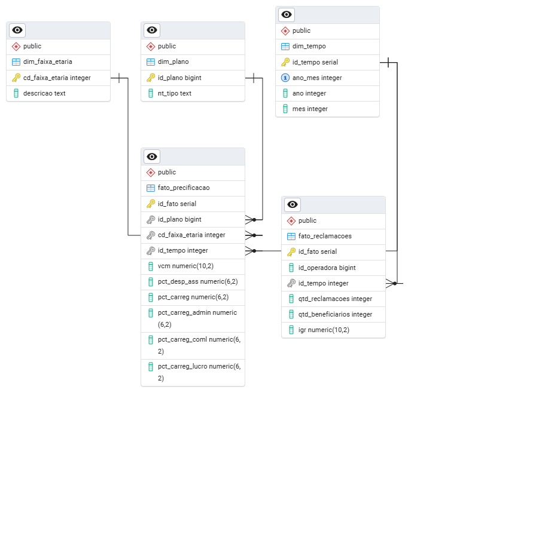

# Monitoramento de Precificação, Custos e Qualidade em Planos de Saúde

**Dados públicos da ANS | SQL - Python - BI (Looker Studio)**

## Visão Geral

Este projeto tem como objetivo **simular o ambiente analítico de uma operadora de saúde**, integrando dados reais de **precificação, estrutura de custos e qualidade percebida pelos beneficiários**, a partir de bases públicas da **ANS**.

A solução foi construída com foco em:

- **monitoramento de indicadores**

- **automação de processos de dados**

- **suporte à tomada de decisão**

## Objetivo do Projeto

**Objetivo Geral**

Desenvolver uma solução de Business Intelligence e Analytics para acompanhar, de forma mensal:

- **o valor dos planos de saúde,**

- **a composição dos custos,**

- **o índice de reclamações dos beneficiários.**

## Objetivos Específicos

- Analisar a evolução do **Valor Comercial da Mensalidade (VCM)**

- Avaliar a participação da **Despesa Assistencial** na precificação

- Monitorar o **Índice Geral de Reclamações (IGR)**

- Comparar tendências entre **Assistência Médica** e **Odontológica**

- Criar dashboards executivos com dados atualizados automaticamente

## Bases de Dados Utilizadas (Dados Reais)

### Precificação de Planos de Saúde – ANS

- Série histórica mensal (últimos 5 anos)

- Valor Comercial da Mensalidade (VCM)

- Percentual de despesa assistencial

- Percentual de carregamentos (administrativo, comercial e lucro)

- Granularidade: **Plano × Faixa Etária × Mês**

### Índice Geral de Reclamações (IGR) – ANS

- IGR por operadora

- Quantidade de reclamações

- Quantidade de beneficiários

- Tipo de cobertura (Médica / Odonto)

- Granularidade: Operadora × Cobertura × Mês

## Dicionário da tabela precificacao_ans.csv

- **ID_PLANO**: Identificação única do plano.
- **CD_NOTA**: Código de registro da nota técnica na ANS - identificação única da nota técnica.
- **NT_TIPO**: Tipo de nota técnica sendo ÚNICA ou MÚLTIPLA
- **CD_FAIXA_ETARIA**: 

    - **Faixa etária do beneficiário vinculado ao contrato**:
        - **(01)**  00 (zero) a 18 (dezoito) anos;
        - **(02)**  19 (dezenove) a 23 (vinte e três) anos;
        - **(03)**  24 (vinte e quatro) a 28 (vinte e oito) anos;
        - **(04)**  29 (vinte e nove) a 33 (trinta e três) anos;
        - **(05)**  34 (trinta e quatro) a 38 (trinta e oito) anos;
        - **(06)**  39 (trinta e nove) a 43 (quarenta e três) anos;
        - **(07)**  44 (quarenta e quatro) a 48 (quarenta e oito) anos;
        - **(08)**  49 (quarenta e nove) a 53 (cinquenta e três) anos;
        - **(09)**  54 (cinquenta e quatro) a 58 (cinquenta e oito) anos;
        - **(10)**  59 (cinquenta e nove) anos ou mais.”
    - **Nota**:  As faixas etárias da NTRP seguem o determinado pelo Art. 2º da Resolução Normativa ANS Nº 563, de 15 de dezembro de 2022.

- **ANO_MES**: Identificador do mês em que o plano estava ativo e disponível para comercialização (formato AAAAMM)
- **VCM**: Valor Comercial da Mensalidade informado na Nota Técnica do plano (Coluna T do Anexo II-B da Resolução Normativa ANS Nº 564, de 15 de dezembro de 2022)
Nota: O Valor Comercial é um valor de referência e pode apresentar diferenças em relação aos preços de comercialização praticados nas tabelas de venda utilizadas pelas operadoras. Os preços efetivamente praticados para a contratação dos produtos devem estar dentro dos limites de comercialização estabelecidos em normativo, quais sejam: 
Limite máximo: 30% acima do Valor Comercial; 
Limite mínimo: o maior valor entre o valor da despesa assistencial estimada e o limiar de 30% abaixo do Valor Comercial;
- **PCT_DESP_ASS**: Despesa assistencial é a proporção de “Despesa Assistencial Líquida por Exposto com Margem de Segurança Estatística por Exposto” (Coluna K do Anexo II-B da Resolução Normativa ANS Nº 564, de 15 de dezembro de 2022) sobre o Valor Comercial da Mensalidade.
- **PCT_CARREG**: Carregamentos referem-se às despesas não assistenciais que são adicionadas na composição do preço de venda. Tais despesas são informadas na nota técnica do plano, conforme disposto no Anexo II-B da Resolução Normativa ANS Nº 564, de 15 de dezembro de 2022. 
Carregamento Total é a soma das “Despesas de Comercialização por beneficiário” (coluna M), das “Outras Despesas da carteira de planos por beneficiáro” (coluna N), das “Despesas Administrativas por beneficiário” (coluna O) e do “Valor da Margem de Lucro por Beneficiário” (coluna R).
A métrica é expressa como proporção do Valor Comercial da Mensalidade.
- **PCT_CARREG_ADMIN**: Carregamento administrativo é a proporção de “Despesas Administrativas por Beneficiário” (coluna O do Anexo II-B da Resolução Normativa ANS Nº 564, de 15 de dezembro de 2022) sobre o Valor Comercial da Mensalidade.
- **PCT_CARREG_COML**: Carregamento comercial é a proporção de “Despesas de Comercialização por Beneficiário” (coluna M do Anexo II-B da Resolução Normativa ANS Nº 564, de 15 de dezembro de 2022) sobre o Valor Comercial da Mensalidade.
- **PCT_CARREG_LUCRO**: Carregamento de lucro é a proporção de “Valor da Margem de Lucro por Beneficiário” (coluna R do Anexo II-B da Resolução Normativa ANS Nº 564, de 15 de dezembro de 2022) sobre o Valor Comercial da Mensalidade.

## Dicionário da tabela igr_ans.csv

- **REGISTRO_ANS**: Registro de operadora de plano privado de assistência à saúde concedido pela ANS a pessoa jurídica para operação no setor de saúde suplementar. 
- **RAZAO_SOCIAL**: Razão Social da Operadora de Plano de Assistência à Saúde
- **COBERTURA**: Categorias de cobertura de produto por tipo de segmentação assistencial:
 Assistência Médica (cobertura médico-hospitalar)
 Exclusivamente odontológica
 - **IGR**: Índice Geral de Reclamação calculado para o mês de competência
 - **QTD_RECLAMACOES**: Quantidade de reclamações de beneficiários de planos de saúde apuradas na NIP (Notificação de Investigação Preliminar)
 - **QTD_BENEFICIARIOS**: Quantidade de beneficiários que tiveram reclamações registradas na ANS no mês de competência
 - **PORTE_OPERADORA**: Classificação da operadora, conforme quantidade de beneficiários com vínculo ativo no mês mais recente disponível no SIB:
    - **Grande** (acima de 100 mil  vínculos de beneficiário ativos)
    - **Médio** (de 20 mil a 100 mil vínculos de beneficiário ativos)
    - **Pequeno** (abaixo de 20 mil vínculos de beneficiário ativos)
- **COMPETENCIA**: Refere-se ao ano e mês de competência das reclamações dos beneficiários (ou seja, do numerador do IGR)
- **COMPETENCIA_BENEFICIARIO**: Refere-se ao ano e mês de competência das informações de beneficiários (ou seja, do denominador do IGR)
- **DT_ATUALIZACAO**: Data e hora da última atualização do arquivo. Os campos sem preenchimento de data indicam que a base está congelada e, portanto, não foi modificada na última atualização.

## EXPLICAÇÃO COMPLETA DO PROJETO

### ETAPA 1 — COLETA DE DADOS (FONTES)

Foram utilizadas **duas bases oficiais da ANS:**

**1. Precificação de Planos**

- Valor Comercial da Mensalidade (VCM)

- Componentes do preço

- Faixa etária

- Série histórica mensal

**2. Índice Geral de Reclamações (IGR)**

- Reclamações registradas

- Número de beneficiários

- Porte da operadora

- Tipo de cobertura

- Série histórica mensal

### ETAPA 2 — ETL EM PYTHON (INGESTÃO)

Foram criados **dois scripts ETL:**

**etl_ingestao_precificacao.py**

Responsável por:

- Ler CSV da ANS

- Tratar encoding (UTF-8, Latin-1, BOM)

- Corrigir separador decimal brasileiro

- Converter tipos (int, float, date)

- Carregar dados em stg_precificacao

**etl_ingestao_igr.py**

Responsável por:

- Ler CSV do IGR

- Tratar inconsistência de schema

- Normalizar nomes de colunas

- Converter métricas numéricas

- Carregar dados em stg_igr

Durante o projeto, foram tratados problemas reais de produção, como:

- BOM invisível em CSV

- Encoding quebrado (Múltipla)

- Divergência entre schema do CSV e do banco

- Limite de parâmetros em INSERTs grandes

### ETAPA 3 — STAGING (POSTGRESQL)

As tabelas de staging armazenam os dados brutos tratados, sem regras de negócio:

- stg_precificacao

- stg_igr

Características:

- Sem chave primária

- Sem agregações

- Usadas apenas como fonte para o modelo analítico

### ETAPA 4 — MODELAGEM DIMENSIONAL (STAR SCHEMA)

Foi criado um modelo estrela, padrão em Analytics e BI.

**Dimensões**

- dim_tempo → eixo temporal mensal

- dim_plano → tipo de plano

- dim_faixa_etaria → segmentação etária

**Fatos**

- fato_precificacao → métricas de preço

- fato_reclamacoes → métricas de reclamação

A integração entre preços e reclamações ocorre via:

- dim_tempo

### ETAPA 5 — CARGA ANALÍTICA (DML)

Foram criados scripts SQL para:

- Popular dimensões com valores únicos

- Popular fatos com métricas numéricas

- Garantir integridade referencial

### ETAPA 6 — INTEGRAÇÃO PREÇO × RECLAMAÇÃO

A integração permite análises como:

- Evolução do VCM vs IGR

- Tipo de plano vs qualidade percebida

- Faixa etária vs custo e reclamação

- Base para correlação estatística

## QUERIES - PERGUNTAS DE NEGÓCIO

**1. QUANTOS REGISTROS EXISTEM EM CADA TABELA FATO?**

- R: HÁ 1.048.575 REGISTROS NA TABELA fato_precificacao E 146.495 REGISTROS NA TABELA fato_reclamacoes.

**2. QUAL É O PERÍODO COBERTO PELOS DADOS?**

- R: O PERÍODO INICIA EM 01/2015 E VAI ATÉ 12/2025.

**3. QUAL É O PREÇO MÉDIO DOS PLANOS?**

- R: O PREÇO MÉDIO DOS PLANOS É DE R$ 857.26.

**4. QUAL É O IGR MÉDIO DO PERÍODO?**

- R: O IGR MÉDIO DO PERÍODO É DE 111.013.

## Stack Tecnológico

- **Banco de Dados:** PostgreSQL

- **ETL:** SQL + Python (pandas, psycopg2)

- **Modelagem:** Star Schema

- **Visualização:** Looker Studio

